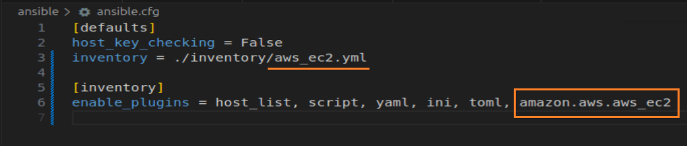
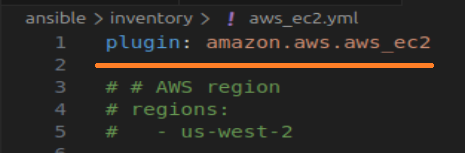
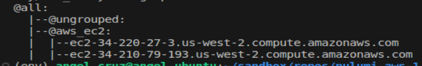
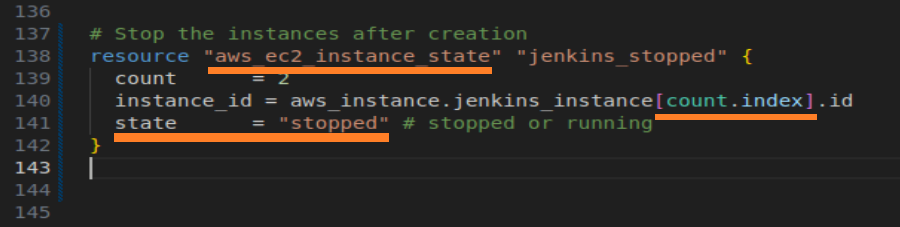
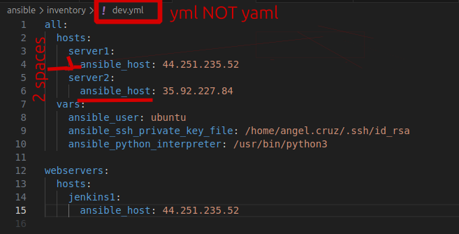

# NOTES

## Ansible: Dynamic Inventory

    (a) Create Plugin List file

```ansible-doc -t inventory -l >> ansible_plugin.txt```

    (b) enable plugin in the ansible.cfg file



    (c) install boto3 natively to your ubuntu VM

    (d) create inventory file that calls the plugin



    (e) run to use inventory file
    
```ansible-inventory -i inventory/aws_ec2.yml --graph```

<br>RESULT:<br>



<br>

__NOTE:__ use --list to get details of instances

You can now use the dynamic inventory:

```ansible all -i inventory/aws_ec2.yml -u ubuntu -m ping```

__NOTE:__ you need "-u ubuntu" to successfully ssh into the instance and ping

## DON'T USE !!! Terraform: create multiple instances, but put them in a stopped state




__RESULT__ : new instances will get recreated and the IP addesses will be different.  Bug since it is supposed to not recreate?


## module -m file

### CREATE A NEW EMPTY FILE 
```ansible all -i inventory/dev.yml -m file -a 'dest=/tmp/temp_test state=touch'```

__NOTE:__ Use single quote *NOT* Double Quote.  However, once you use single quote, you can then use double quote?  WTF?

<br>

__state__: state must be one of: <br>
- absent
- directory
- file
- hard
- link
- touch


## COPY FILES FROM CONTROLLER TO CLIENTS

ansible [group] -m copy -a[src=source_path dest=destination_path]

```ansible -i inventory/dev.yml all -m copy -a "src=/home/angel.cruz/sandbox/repos/pulumi-aws-1/ansible/hello_world.yml   dest=/tmp/test.yml"```

<br> After the file is copied, validate by going to one of the servers:
```ssh ubuntu@44.247.77.183```

<br> -> cd /tmp and cat test.yamlfile


## COPY A NEW FILE WITH CONTENT
```ansible -i inventory/dev.yml all -m copy -a "content='This is a NEW CONTENT FROM ANGEL'  dest=/tmp/junk.yml"```

<br> Validate by ssh into a server, go to /tmp, and cat junk.yml


## SHELL
<br> -m shell -a <shell executable>
<br>
```
ansible webservers -i inventory/dev.yml -m shell -a "free -m"
```
<br>(NOTE: use module 'shell' with arguments 'free -m')<br>

<br>*RESULT*
jenkins1 | CHANGED | rc=0 >> <br>


|               | Total     | Used  |free  |shared|buff/cache|available|
| ------------- |:---------:| -----:|-----:|-----:|    -----:|   -----:|
| Mem:          | 954       |187    |218   |0     |548       |605      |
| Swap:         |0          |0      |0

<br>other shell commands:
<br> ```ansible webservers -i inventory/dev.yml -m shell -a "cat /etc/os-release"```

***NOTE:***
To see what available modules exist for ansible:<br>
```ansible-doc -l```


## PING
<br> the '-m ping' below means **module 'ping'**

<br>*ALL*

```
ansible -i inventory/dev.yml all -m ping
```
*INDIVIDUAL* <br>
```ansible jenkins1 -i inventory/dev.yml -m ping``` <br>
OR <br>
```ansible server2 -i inventory/dev.yml -m ping``` <br>

(NOTE: reference it with the name given above 'ansible_host') <br>

*BY GROUP* <br>
```ansible webservers -i inventory/dev.yml -m ping``` <br>
(NOTE: 'webservers' is the group name) <br>

---

## Error 1: bad format of YAML inventory

## SOLUTION 


## Lesson Learned
<br>1. yml file NOT yaml file (ansible will not recognize it)
<br>2. hosts: / <server_name> / ansible_host (ansible_host is required)


## Error 1 Message

"[WARNING]:  * Failed to parse /home/angel.cruz/sandbox/repos/pulumi-aws-1/ansible/inventory/dev.yaml
with ini plugin: Invalid host pattern 'webservers:' supplied, ending in ':' is not allowed, this
character is reserved to provide a port."
<br>
This warning means Ansible is trying to treat your dev.yaml as a YAML inventory plugin config file, but it doesn't have the required plugin key at the root.

<br>How to fix:<br>

If dev.yaml is a static YAML inventory:
<br>Make sure it follows the YAML inventory format:

<br>Example:


<br># filepath: /home/angel.cruz/sandbox/repos/pulumi-aws-1/ansible/inventory/dev.yaml
<br>all:  
<br>  hosts:    
<br>    server1:      
<br>      ansible_host: 34.221.233.84    
<br>    server2:      
<br>      ansible_host: 34.221.86.243  
<br>   vars:    
<br>     ansible_user: ubuntu    
<br>     ansible_ssh_private_key_file: /home/angel.cruz/.ssh/id_rsa

