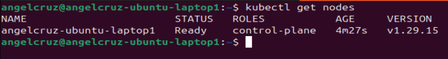
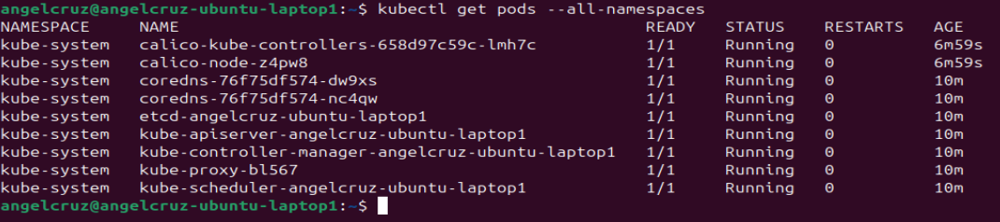
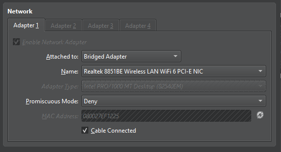
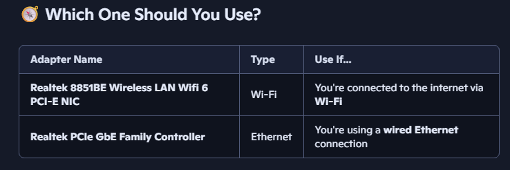

## SETUP with ubuntu-server(controller) and two raspberry pi's (workers)
(NOTE: second worker will be attempted with Ansible instead of manual steps below)

## STARTING OVER AGAIN 
### CONTROLLER

__1> Reset__

    sudo kubeadm reset -f

This command unconfigures the Kubernetes cluster and cleans up local files created by kubeadm init or kubeadm join. Purge Kubernetes Packages.


__2> Purge__

    sudo apt-get purge kubeadm kubectl kubelet kubernetes-cni -y
    sudo apt-get autoremove -y

This removes the Kubernetes packages and any automatically installed dependencies that are no longer needed. Remove Residual Files and Directories.

__3> remove config files__

    sudo rm -rf /etc/cni /etc/kubernetes /var/lib/dockershim /var/lib/etcd /var/lib/kubelet /var/run/kubernetes ~/.kube/

This removes directories and files related to Kubernetes configuration, CNI, etcd data, kubelet, and user-specific Kubernetes configurations. Clear IPTables Rules.

__4> flush and delete rules__

    sudo iptables -F && sudo iptables -X
    sudo iptables -t nat -F && sudo iptables -t nat -X
    sudo iptables -t raw -F && sudo iptables -t raw -X
    sudo iptables -t mangle -F && sudo iptables -t mangle -X

These commands flush and delete all rules and chains from the filter, nat, raw, and mangle iptables tables, which are used by Kubernetes for networking. Clean up Docker (Optional but Recommended).


__5> restart docker daemon__

    sudo systemctl restart docker
    docker rm -f $(docker ps -a | grep "k8s_" | awk '{print $1}')

This restarts the Docker daemon and removes any containers that were part of the Kubernetes cluster. Reboot the Server.  <br>

If using containerd:

    sudo apt-get purge docker-ce docker-ce-cli containerd.io docker-buildx-plugin docker-compose-plugin
    sudo rm -rf /var/lib/docker
    sudo rm -rf /var/lib/containerd

__6> check /etc/apt/sources.list.d/__
<br>
Ensure docker.list and kubernetes.list do not exist.  Empty out the directory if needed.

Check other files and rm:
<br>
sudo rm /etc/apt/trusted.gpg.d/kubernetes-release.gpg
<br>
sudo rm /etc/apt/keyrings/docker.gpg

__6> reboot__

    sudo reboot

A reboot ensures all services are properly reset and any lingering processes are terminated.
After these steps, your Ubuntu server should be free of Kubernetes components, allowing for a clean reinstallation.

### First Step: ping the servers with Ansible

    ansible all -i inventory.ini -m ping

#### UBUNTU-SERVER (CONTROLLER)
username: angelcruz <br>
ip-address: 192.168.1.99 <br>

username: pi <br>
ip-address: 192.168.1.248 <br>

username: pi <br>
ip-address: 192.168.1.97 <br>


From your desktop, you can auto login and ssh as the user by copying your ssh id to the remote servers, for example:<br>

    ssh-copy-id pi@192.168.1.248 (log in normally)
    ssh pi@192.168.1.248 (you will get logged in automatically)
    
### Manually installing kubernetes on the Master Node

This guide focuses on setting up a single-node control plane using kubeadm.

Prerequisites (on the control plane node):

Code

    sudo apt update && sudo apt upgrade -y

### Disable Swap  (Master and Workers): Kubernetes requires swap to be disabled.

Code

    sudo swapoff -a
    sudo sed -i '/ swap / s/^\(.*\)$/#\1/g' /etc/fstab

### Configure Kernel Modules and Parameters: Enable necessary kernel modules and sysctl parameters for Kubernetes networking.

Code

    sudo modprobe overlay
    sudo modprobe br_netfilter
    
    cat <<EOF | sudo tee /etc/modules-load.d/k8s.conf
    overlay
    br_netfilter
    EOF
    
    cat <<EOF | sudo tee /etc/sysctl.d/k8s.conf
    net.bridge.bridge-nf-call-iptables  = 1
    net.bridge.bridge-nf-call-ip6tables = 1
    net.ipv4.ip_forward                 = 1
    EOF

Invoke: <br>

Code

    sudo sysctl --system


###  Install Container Runtime (e.g., containerd): Kubernetes needs a container runtime.

__NOTE:__<br>
For worker install (raspberry pi), ensure you change in the code below:<br>

https://pkgs.k8s.io/core:/stable:/v1.33/ubuntu/ 

TO:<br>

https://pkgs.k8s.io/core:/stable:/v1.33/debian/

Code (for ubuntu)

        sudo apt update
        sudo apt install -y apt-transport-https ca-certificates curl gnupg lsb-release
        sudo mkdir -p /etc/apt/keyrings

        # SET ENVIRONMENT VARIABLE AS ubuntu (controller) or debian (worker..raspbian?)

        export my_os="ubuntu"
        export my_k8_version="v.133"

        echo $my_os
        echo $my_k8_version
        
> 1. Prepare Your System

        sudo apt-get update
        sudo apt-get install -y apt-transport-https ca-certificates curl
        sudo swapoff -a  # Kubernetes requires swap to be disabled

> 2. Install Container Runtime (e.g., containerd)

        sudo apt-get install -y containerd

> 3. Add Kubernetes Repo and Install Tools

        sudo rm /etc/apt/sources.list.d/kubernetes.list
        echo "deb [signed-by=/etc/apt/keyrings/kubernetes-apt-keyring.gpg] https://pkgs.k8s.io/core:/stable:/v1.33/deb/ /" | sudo tee /etc/apt/sources.list.d/kubernetes.list

        curl -fsSL https://pkgs.k8s.io/core:/stable:/v1.33/deb/Release.key | sudo gpg --dearmor -o /etc/apt/keyrings/kubernetes-apt-keyring.gpg

        echo "deb [signed-by=/etc/apt/keyrings/kubernetes-apt-keyring.gpg] https://pkgs.k8s.io/core:/stable:/v1.33/deb/ /" | sudo tee /etc/apt/sources.list.d/kubernetes.list


> 4. Update Package Lists

        sudo apt-get update

> 5.Install kubernetes tools

Controller Server:

        sudo apt-get install -y kubelet kubeadm kubectl
        sudo apt-mark hold kubelet kubeadm kubectl


        #7 generates a default configuration file for Containerd >> Not needed?
        #sudo containerd config default | sudo tee /etc/containerd/config.toml
        
        #8 Change the SystemdCgroup setting from false to true
        sudo sed -i 's/SystemdCgroup = false/SystemdCgroup = true/g' /etc/containerd/config.toml
        
        #9 restart and enable containerd 
        sudo systemctl restart containerd
        sudo systemctl enable containerd

        #10 start the cluster:
        sudo kubeadm init --pod-network-cidr=10.244.0.0/16

Worker Node (Raspberry pi)

>1. edit boot flie

    sudo nano /boot/firmware/cmdline.txt
>2. Add these parameters to the end of the single line (don’t create a new line)

    cgroup_enable=memory cgroup_memory=1

>3. reboot

>4. validate

    mount | grep cgroup

__Result:__ <br>
cgroup2 on /sys/fs/cgroup type cgroup2 (rw,nosuid,nodev,noexec,relatime,nsdelegate,memory_recursiveprot)

<br>System is using cgroup v2, which is totally fine for Kubernetes as long as your version supports it (most do from v1.20 onward). That explains why /sys/fs/cgroup/memory doesn’t exist—because in cgroup v2, memory management is integrated into a unified hierarchy.

__NOTE:__ <br>

Since I am using containerd, I don't need to add the steps to add the Docker GPG and Docker repository, correct?

Exactly — you're spot on. Since you're using containerd as your container runtime, there's no need to add Docker's GPG key or repository. Kubernetes supports containerd natively, and it's actually the preferred runtime for many production setups due to its simplicity and tighter integration with Kubernetes.

Here’s what that means for you:

    ✅ You can skip any steps involving https://download.docker.com or installing docker-ce.

    ✅ No need to configure Docker daemon settings like cgroupDriver.

    ✅ containerd works seamlessly with kubeadm and supports the CRI (Container Runtime Interface) out of the box.

### Install Calico

It's quite common to apply the network plugin afterward.

> a. Make sure your kubectl is configured:

    mkdir -p $HOME/.kube
    sudo cp -i /etc/kubernetes/admin.conf $HOME/.kube/config
    sudo chown $(id -u):$(id -g) $HOME/.kube/config


> b. Apply the Calico manifest:

    kubectl apply -f https://docs.projectcalico.org/manifests/calico.yaml


### Error: Initializing Kubernetes Control Plane:
Initialize the Cluster: Replace <your_pod_cidr> with a suitable CIDR range (e.g., 10.244.0.0/16 for Calico).

Code

    sudo kubeadm init --pod-network-cidr=10.244.0.0/16

<br>
RESULT: FAIL <br>
You may get this error <br>
"Error execution phase preflight: [preflight]<br> Some fatal errors occurred:<br>
	[ERROR Port-10250]: Port 10250 is in use<br>
"
<br>
Fix it with:

    sudo netstat -tulnp | grep 10250

This will show <"the-PID"/kubelet><br>

    sudo kill -9 11511

Re-run "kubeadm init.."

RESULT: SUCCESS

```
Your Kubernetes control-plane has initialized successfully!

To start using your cluster, you need to run the following as a regular user:

  mkdir -p $HOME/.kube
  sudo cp -i /etc/kubernetes/admin.conf $HOME/.kube/config
  sudo chown $(id -u):$(id -g) $HOME/.kube/config

Alternatively, if you are the root user, you can run:

  export KUBECONFIG=/etc/kubernetes/admin.conf

You should now deploy a pod network to the cluster.
Run "kubectl apply -f [podnetwork].yaml" with one of the options listed at:
  https://kubernetes.io/docs/concepts/cluster-administration/addons/

Then you can join any number of worker nodes by running the following on each as root:

kubeadm join 192.168.1.100:6443 --token uskjn0.6j6cpeywo3jlq5of \
	--discovery-token-ca-cert-hash sha256:f9ef604bef57dc5a5550b58ffd6b102e3932d6aad5ce28d9a450195857b29415 

```

NOTE: To create the join commands again, invoke:<br>
``` kubeadm token create --print-join-command ```
<br> The above is required if adding new worker nodes at a later time


## If your controller server changes IP, you need to re-configure:


### 1. Backup existing PKI

    sudo mkdir -p /etc/kubernetes/pki/backup
    sudo rsync -av --exclude backup /etc/kubernetes/pki/ /etc/kubernetes/pki/backup/

### 2. Update static pod manifests

Edit /etc/kubernetes/manifests/etcd.yaml:
<br>Replace all old IPs with the new control-plane IP:

    --initial-advertise-peer-urls=https://<NEW-IP>:2380
    --listen-peer-urls=https://<NEW-IP>:2380
    --advertise-client-urls=https://<NEW-IP>:2379
    --listen-client-urls=https://127.0.0.1:2379,https://<NEW-IP>:2379

### 3. Update the annotations

    kubeadm.kubernetes.io/etcd.advertise-client-urls: https://<NEW-IP>:2379


Note: Leave --etcd-servers=https://127.0.0.1:2379 in /etc/kubernetes/manifests/kube-apiserver.yaml. Do not change it to the new IP.

### 4. Remove old certificates that reference the old IP

    sudo rm /etc/kubernetes/pki/etcd/server.*
    sudo rm /etc/kubernetes/pki/etcd/peer.*
    sudo rm /etc/kubernetes/pki/etcd/healthcheck-client.*
    sudo rm /etc/kubernetes/pki/apiserver-etcd-client.*
    sudo rm /etc/kubernetes/pki/apiserver.*

### 5. Regenerate etcd certificates


    sudo kubeadm init phase certs etcd-server
    sudo kubeadm init phase certs etcd-peer
    sudo kubeadm init phase certs etcd-healthcheck-client
    sudo kubeadm init phase certs apiserver-etcd-client


### 6 Regenerate apiserver certificate with the new IP

    sudo kubeadm init phase certs apiserver --apiserver-cert-extra-sans <NEW-IP>

### 7. Restart kubelet

    sudo systemctl restart kubelet

### 8. Verify cluster components

#### Check etcd:

    sudo crictl ps | grep etcd
    sudo crictl logs $(sudo crictl ps -a --name etcd -q | head -n1)


#### Check kube-apiserver:

    sudo crictl ps | grep kube-apiserver
    sudo crictl logs $(sudo crictl ps -a --name kube-apiserver -q | head -n1)


### Check nodes and system pods:

    kubectl get nodes
    kubectl get pods -n kube-system


RESULT:<br>



Note:
you can all of the above steps  by running script:<br>

    ./refresh-k8-ip-changed.sh

### The control plane node should show as Ready. Check Pods.

Code

    kubectl get pods --all-namespaces

All core Kubernetes pods (kube-apiserver, kube-controller-manager, kube-scheduler, etcd, coredns) and the network plugin pods should be running.




## Anytime you do a kubeadm init, it is a good idea to reapply your kubeconfig file:


> Reconfigure kubectl to Use the Correct Kubeconfig

    mkdir -p $HOME/.kube
    sudo cp -i /etc/kubernetes/admin.conf $HOME/.kube/config
    sudo chown $(id -u):$(id -g) $HOME/.kube/config

## SETUP Ubuntu VBox (workers)

1> Set up the VBox Networking

Chose the Name for the WiFi



Choices:


So if you're currently on Wi-Fi (which is most common on laptops), select the Wireless LAN Wifi 6 PCI-E NIC in the Bridged Adapter settings.

1. Go to VirtualBox → Settings → Network → Adapter 1.

2. Set Attached to: Bridged Adapter.

3. Set Name: Realtek 8851BE Wireless LAN Wifi 6 PCI-E NIC.

4. Click OK, then start your VM.

5. Once it boots up, run:

        ip addr show


## SETUP Raspberry Pi (workers)
server: 192.168.1.248 <br>
user: pi <br>
vnc pass: rasp... <br>


### Disable Swap: Kubernetes requires swap to be disabled.

Code

    sudo swapoff -a
    sudo sed -i '/ swap / s/^\(.*\)$/#\1/g' /etc/fstab

### Enable Kernel Modules and Configure sysctl.

Code

    cat <<EOF | sudo tee /etc/modules-load.d/k8s.conf
    overlay
    br_netfilter
    EOF

    sudo modprobe overlay
    sudo modprobe br_netfilter

    cat <<EOF | sudo tee /etc/sysctl.d/k8s.conf
    net.bridge.bridge-nf-call-iptables = 1
    net.bridge.bridge-nf-call-ip6tables = 1
    net.ipv4.ip_forward = 1
    EOF

    sudo sysctl --system


### Install necessary packages and add Docker's GPG key and repository:

Code

    sudo apt-get update -y
    sudo apt-get install ca-certificates curl gnupg lsb-release -y
    sudo mkdir -p /etc/apt/keyrings
    curl -fsSL https://download.docker.com/linux/debian/gpg | sudo gpg --dearmor -o /etc/apt/keyrings/docker.gpg
    echo "deb [arch=$(dpkg --print-architecture) signed-by=/etc/apt/keyrings/docker.gpg] https://download.docker.com/linux/debian $(lsb_release -cs) stable" | sudo tee /etc/apt/sources.list.d/docker.list > /dev/null

### Install Containerd and configure its cgroup driver:

Code

    sudo apt-get update -y
    sudo apt-get install containerd.io -y
    sudo containerd config default | sudo tee /etc/containerd/config.toml
    sudo sed -i 's/SystemdCgroup = false/SystemdCgroup = true/g' /etc/containerd/config.toml
    sudo systemctl restart containerd

### Add Kubernetes apt repository.

Code

    sudo apt-get update
    sudo apt-get install -y apt-transport-https ca-certificates curl
    curl -fsSL https://pkgs.k8s.io/core:/stable:/v1.29/deb/Release.key | sudo gpg --dearmor -o /etc/apt/keyrings/kubernetes-apt-keyring.gpg
    echo 'deb [signed-by=/etc/apt/keyrings/kubernetes-apt-keyring.gpg] https://pkgs.k8s.io/core:/stable:/v1.29/deb/ /' | sudo tee /etc/apt/sources.list.d/kubernetes.list


Note: Replace v1.29 with your desired Kubernetes version if different. Install the Kubernetes components.

### install kubeadm and kubelet:

Code

    sudo apt-get update
    sudo apt-get install -y kubelet kubeadm kubectl

### Hold the packages to prevent automatic updates:

Code

    sudo apt-mark hold kubelet kubeadm kubectl

### create resolv.conf

    sudo mkdir -p /run/systemd/resolve
    sudo ln -sf /etc/resolv.conf /run/systemd/resolve/resolv.conf
    sudo systemctl restart kubelet

### ensure port 10250 is open
    sudo netstat -tulnp | grep 10250

If not, kill it: <br>

    sudo kill -9 "the-pid"

### Join the Cluster

Code

    kubeadm join 192.168.1.100:6443 --token uskjn0.6j6cpeywo3jlq5of --discovery-token-ca-cert-hash sha256:f9ef604bef57dc5a5550b58ffd6b102e3932d6aad5ce28d9a450195857b29415

__RESULT__:

kubeadm join The system verification failed CONFIG_AUFS_FS: not set - Required for aufs CONFIG_CGROUP_HUGETLB: not set - Required for hugetlb cgroup. CGROUPS_MEMORY: missing CGROUPS_HUGETLB: missing


[WARNING SystemVerification]: <span style="color:red">missing optional cgroups: hugetlb</span>
    error execution phase preflight: [preflight] Some fatal errors occurred:
<span style="color:red">[ERROR SystemVerification]: missing required cgroups: memory</span>
    [preflight] If you know what you are doing, you can make a check non-fatal with `--ignore-preflight-errors=...

__Attempt to Fix:__

*Enable Memory Cgroups on Raspberry Pi OS*

Edit the boot configuration: Open the boot command line file:
Add these parameters to the end of the line (don’t create a new line):

    sudo nano /boot/cmdline.txt
    cgroup_enable=memory cgroup_memory=1

    sudo reboot


Verify cgroups are enabled: After reboot, check:

    mount | grep cgroup

result:<br>
"cgroup2 on /sys/fs/cgroup type cgroup2 (rw,nosuid,nodev,noexec,relatime,nsdelegate,memory_recursiveprot)"
<br>Looks good.

### Rerun the join command:

    sudo kubeadm join 192.168.1.100:6443 --token uskjn0.6j6cpeywo3jlq5of --discovery-token-ca-cert-hash sha256:f9ef604bef57dc5a5550b58ffd6b102e3932d6aad5ce28d9a450195857b29415

*Result:*
node not coming up

__Attempt to Fix:__

    sudo systemctl status kubelet
    sudo journalctl -u kubelet -xe > tmp_log.txt

*check the contents of the tmp_log.txt file:*<br>

"command failed" err="failed to run Kubelet: running with swap on is not supported, please disable swap!

Note: <br>
Swap is still on?  We already disabled it?

### turn swap off again 

    sudo swapoff -a

### check /etc/fstab file

    sudo nano /etc/fstab

### Look for a line that references swap, something like:
    /swapfile swap swap defaults 0 0

### is dynamic swapping on?
    sudo swapon --show

Result: <br>
No

### CLEANUP kubeadm join first before rerunning:
    sudo kubeadm reset
    sudo systemctl stop kubelet

__Then verify port 10250 is free__:

    sudo lsof -i :10250

__Remove Leftover files:__

    sudo rm -rf /etc/kubernetes
    sudo rm -rf /var/lib/kubelet
    sudo rm -rf /var/lib/etcd
    sudo rm -rf ~/.kube

### In Master Server: Get state of Nodes 

    k get nodes

Result:<br>

    raspberrypi-1              NotReady   <none>          9m54s   v1.29.15 

### Check Node Conditions

    open /run/systemd/resolve/resolv.conf: no such file or directory

<br> OR you can run this command and it will lead to the same result

    kubectl describe node raspberrypi-1

results: <br>
open /run/systemd/resolve/resolv.conf: no such file or directory

__Fix attempt:__

On your Raspberry Pi node, run:

    sudo ln -sf /etc/resolv.conf /run/systemd/resolve/resolv.conf

result: <br>
this fails because /run/systemd/resolve does not exist.  Need to create it manually.

__create it then in raspberry pi:__

    sudo mkdir -p /run/systemd/resolve
    sudo ln -sf /etc/resolv.conf /run/systemd/resolve/resolv.conf
    sudo systemctl restart kubelet

*RESULT*:<br>
__SUCCESS__

## FIX FOR SECOND WORKER TO JOIN SUCCESSFULLY

__Kubernetes Worker Node Join Script (Manual Kubelet Setup)__

⚠️ Assumes:

- You’ve manually placed the correct kubelet binary at /usr/local/bin/kubelet

- You have a valid bootstrap-kubelet.conf and kubelet.conf from the control plane

- Containerd is installed and running

Bash

    #!/bin/bash

    set -e

    echo "🔧 Configuring kubelet systemd overrides..."

### Create systemd override to use correct kubelet binary and flags
    sudo mkdir -p /etc/systemd/system/kubelet.service.d

    cat <<EOF | sudo tee /etc/systemd/system/kubelet.service.d/99-custom.conf
    [Service]
    ExecStart=
    ExecStart=/usr/local/bin/kubelet \$KUBELET_KUBEADM_ARGS \$KUBELET_EXTRA_ARGS
    EOF

    echo "🧹 Cleaning up deprecated flags..."

### Remove deprecated container runtime flags
    sudo sed -i 's/--container-runtime[^"]*//g' /etc/default/kubelet || true
    sudo sed -i 's/--container-runtime[^"]*//g' /etc/systemd/system/kubelet.service.d/10-containerd.conf || true

### Ensure fallback args are clean
    echo 'KUBELET_EXTRA_ARGS="--fail-swap-on=false"' | sudo tee /etc/default/kubelet
    echo '[Service]
    Environment="KUBELET_EXTRA_ARGS=--fail-swap-on=false"' | sudo tee /etc/systemd/system/kubelet.service.d/10-containerd.conf

    echo "📝 Updating kubelet config.yaml..."

### Set containerRuntimeEndpoint in kubelet config

🧠 Pro Tip

## ANSIBLE SCRIPT TO JOIN

🚀 Ansible Playbook: Join Kubernetes Worker Node with Manual Kubelet

Here’s a full playbook that:

- Configures systemd to use your manually installed kubelet

- Cleans up deprecated flags

- Updates the kubelet config file

- Restarts services to trigger CSR submission

📁 File: join-worker.yml

yaml

    ---
    - name: Join Kubernetes Worker Node
    hosts: workers
    become: true
    vars:
        kubelet_bin_path: /usr/local/bin/kubelet
        node_ip: "{{ ansible_host }}"
        containerd_socket: unix:///run/containerd/containerd.sock

    tasks:

        - name: Ensure systemd drop-in directory exists
        file:
            path: /etc/systemd/system/kubelet.service.d
            state: directory
            mode: '0755'

        - name: Configure kubelet ExecStart override
        copy:
            dest: /etc/systemd/system/kubelet.service.d/99-custom.conf
            content: |
            [Service]
            ExecStart=
            ExecStart={{ kubelet_bin_path }} $KUBELET_KUBEADM_ARGS $KUBELET_EXTRA_ARGS

        - name: Clean up deprecated flags in /etc/default/kubelet
        lineinfile:
            path: /etc/default/kubelet
            regexp: '--container-runtime'
            state: absent
        ignore_errors: true

        - name: Set fallback kubelet args
        copy:
            dest: /etc/default/kubelet
            content: 'KUBELET_EXTRA_ARGS="--fail-swap-on=false"'

        - name: Clean up deprecated flags in 10-containerd.conf
        copy:
            dest: /etc/systemd/system/kubelet.service.d/10-containerd.conf
            content: |
            [Service]
            Environment="KUBELET_EXTRA_ARGS=--fail-swap-on=false"

        - name: Set containerRuntimeEndpoint in kubelet config
        replace:
            path: /var/lib/kubelet/config.yaml
            regexp: '^containerRuntimeEndpoint:.*'
            replace: 'containerRuntimeEndpoint: "{{ containerd_socket }}"'

        - name: Reload systemd
        command: systemctl daemon-reload

        - name: Restart kubelet
        service:
            name: kubelet
            state: restarted

        - name: Wait for kubelet to submit CSR
        pause:
            seconds: 60

        - name: Reminder to approve CSR
        debug:
            msg: |
            ✅ Kubelet restarted. Now run on control plane:
            kubectl get csr --kubeconfig=/etc/kubernetes/admin.conf
            Then approve with:
            kubectl certificate approve <csr-name>

🧠 How to Use
Add your worker nodes to your Ansible inventory under [workers]

__Run the playbook:__

Bash
    ansible-playbook -i inventory join-worker.yml

On the control plane, approve the CSR:

Bash
    kubectl get csr --kubeconfig=/etc/kubernetes/admin.conf
    kubectl certificate approve <csr-name>

## Step-by-Step: Auto-Approve Kubelet CSRs

1> ✅ Create ClusterRoleBinding for Auto-Approval

Add this task to your Ansible playbook (run on the control plane):

yaml

    - name: Create ClusterRoleBinding for kubelet CSR auto-approval
    kubernetes.core.k8s:
        state: present
        definition:
        apiVersion: rbac.authorization.k8s.io/v1
        kind: ClusterRoleBinding
        metadata:
            name: auto-approve-kubelet-csrs
        subjects:
            - kind: Group
            name: system:bootstrappers
            apiGroup: rbac.authorization.k8s.io
        roleRef:
            kind: ClusterRole
            name: system:node-bootstrapper
            apiGroup: rbac.authorization.k8s.io

2> 🔁 Add Controller to Approve CSRs
You can deploy a lightweight controller that watches for CSRs and approves them if they match kubelet criteria. Here’s a basic example using a Kubernetes Job:

yaml

    - name: Deploy CSR auto-approver job
    kubernetes.core.k8s:
        state: present
        definition:
        apiVersion: batch/v1
        kind: Job
        metadata:
            name: csr-auto-approver
            namespace: kube-system
        spec:
            template:
            spec:
                containers:
                - name: approver
                    image: bitnami/kubectl:latest
                    command:
                    - /bin/sh
                    - -c
                    - |
                        while true; do
                        for csr in $(kubectl get csr --no-headers | awk '/Pending/ {print $1}'); do
                            kubectl certificate approve $csr
                        done
                        sleep 10
                        done
                restartPolicy: Never

You can also run this as a CronJob or a sidecar in your control plane if you want continuous monitoring.

🧠 Smarter Option: Use a Validating Webhook
For production-grade clusters, consider using a validating admission webhook or a custom controller with logic to verify node identity before approval.

### MISC NOTES

Disable Swap: Kubernetes requires swap to be disabled.

Code

    sudo swapoff -a
    sudo sed -i '/ swap / s/^\(.*\)$/#\1/g' /etc/fstab
---
Enable Kernel Modules and Configure sysctl.

Code

    cat <<EOF | sudo tee /etc/modules-load.d/k8s.conf
    overlay
    br_netfilter
    EOF

    sudo modprobe overlay
    sudo modprobe br_netfilter

    cat <<EOF | sudo tee /etc/sysctl.d/k8s.conf
    net.bridge.bridge-nf-call-iptables = 1
    net.bridge.bridge-nf-call-ip6tables = 1
    net.ipv4.ip_forward = 1
    EOF

    sudo sysctl --system
---
Install necessary packages and add Docker's GPG key and repository:

Code

    sudo apt-get update -y
    sudo apt-get install ca-certificates curl gnupg lsb-release -y
    sudo mkdir -p /etc/apt/keyrings
    curl -fsSL https://download.docker.com/linux/debian/gpg | sudo gpg --dearmor -o /etc/apt/keyrings/docker.gpg
    echo "deb [arch=$(dpkg --print-architecture) signed-by=/etc/apt/keyrings/docker.gpg] https://download.docker.com/linux/debian $(lsb_release -cs) stable" | sudo tee /etc/apt/sources.list.d/docker.list > /dev/null
---
Install Containerd and configure its cgroup driver:

Code

    sudo apt-get update -y
    sudo apt-get install containerd.io -y
    sudo containerd config default | sudo tee /etc/containerd/config.toml
    sudo sed -i 's/SystemdCgroup = false/SystemdCgroup = true/g' /etc/containerd/config.toml
    sudo systemctl restart containerd
---
Add Kubernetes apt repository.
Code

    sudo apt-get update
    sudo apt-get install -y apt-transport-https ca-certificates curl
    curl -fsSL https://pkgs.k8s.io/core:/stable:/v1.29/deb/Release.key | sudo gpg --dearmor -o /etc/apt/keyrings/kubernetes-apt-keyring.gpg
    echo 'deb [signed-by=/etc/apt/keyrings/kubernetes-apt-keyring.gpg] https://pkgs.k8s.io/core:/stable:/v1.29/deb/ /' | sudo tee /etc/apt/sources.list.d/kubernetes.list

Note: <br>
Replace v1.29 with your desired Kubernetes version if different. Install the Kubernetes components.

---
    sudo apt-get update
    sudo apt-get install -y kubelet kubeadm kubectl
---
Hold the packages to prevent automatic updates:
Code

    sudo apt-mark hold kubelet kubeadm kubectl

---
JOIN:<br>

    kubeadm join 192.168.1.100:6443 --token uskjn0.6j6cpeywo3jlq5of --discovery-token-ca-cert-hash sha256:f9ef604bef57dc5a5550b58ffd6b102e3932d6aad5ce28d9a450195857b29415

RESULTS:<br>
>kubeadm join The system verification failed CONFIG_AUFS_FS: not set - Required for aufs CONFIG_CGROUP_HUGETLB: not set - Required for hugetlb cgroup. CGROUPS_MEMORY: missing CGROUPS_HUGETLB: missing


[WARNING SystemVerification]: missing optional cgroups: hugetlb
error execution phase preflight: [preflight] Some fatal errors occurred:
	[ERROR SystemVerification]: missing required cgroups: memory
[preflight] If you know what you are doing, you can make a check non-fatal with `--ignore-preflight-errors=...

Solution:<br>
>Enable Memory Cgroups on Raspberry Pi OS

Edit the boot configuration: Open the boot command line file:
Add these parameters to the end of the line (don’t create a new line):

sudo nano /boot/cmdline.txt:<br>
>cgroup_enable=memory cgroup_memory=1

    sudo reboot

Verify cgroups are enabled: After reboot, check:

    mount | grep cgroup

result:<BR>
cgroup2 on /sys/fs/cgroup type cgroup2 (rw,nosuid,nodev,noexec,relatime,nsdelegate,memory_recursiveprot)

Rerun the join command:
pi@raspberrypi-1:~ $ 

    sudo kubeadm join 192.168.1.100:6443 --token uskjn0.6j6cpeywo3jlq5of --discovery-token-ca-cert-hash sha256:f9ef604bef57dc5a5550b58ffd6b102e3932d6aad5ce28d9a450195857b29415

Fix:

    sudo systemctl status kubelet

    sudo journalctl -u kubelet -xe > tmp_log.txt

"command failed" err="failed to run Kubelet: running with swap on is not supported, please disable swap!

> Code

    sudo swapoff -a
    sudo nano /etc/fstab

> Look for a line that references swap, something like:

    /swapfile swap swap defaults 0 0

> dynamic swapping?

    sudo swapon --show

CLEANUP kubeadm join first before rerunning:
Code

    sudo kubeadm reset
    sudo systemctl stop kubelet

Then verify port 10250 is free:

    sudo lsof -i :10250

Remove Leftover files:

    sudo rm -rf /etc/kubernetes
    sudo rm -rf /var/lib/kubelet
    sudo rm -rf /var/lib/etcd
    sudo rm -rf ~/.kube
    sudo swapoff -a
    sudo sed -i '/ swap / s/^\(.*\)$/#\1/g' /etc/fstab

On Master server:

    k get nodes
results:<br>
raspberrypi-1              NotReady   <none>          9m54s   v1.29.15

Step 1: Check Node Conditions<br>
open /run/systemd/resolve/resolv.conf: no such file or directory

    kubectl describe node raspberrypi-1

results: <br>
open /run/systemd/resolve/resolv.conf: no such file or directory

Fix attempt:
On your Raspberry Pi node, run:

    sudo ln -sf /etc/resolv.conf /run/systemd/resolve/resolv.conf
result: this fails

create it then in raspberry pi:

    sudo mkdir -p /run/systemd/resolve
    sudo ln -sf /etc/resolv.conf /run/systemd/resolve/resolv.conf
    sudo systemctl restart kubelet

SUCCESS!!

TEST:
deploy nginx to k8

> create hello-world1.yaml

    ---
    apiVersion: v1
    kind: ConfigMap
    metadata:
    name: nginx-config-1
    namespace: default
    data:
    index.html: |
        <html>
        <h2>Hello world 1!!</h2>
        </html>
    ---
    apiVersion: apps/v1
    kind: Deployment
    metadata:
    name: nginx-deployment-1
    spec:
    replicas: 2
    selector:
        matchLabels:
        app: nginx
    template:
        metadata:
        labels:
            app: nginx
            testService: service1
        spec:
        containers:
        - name: nginx
            image: nginx
            ports:
            - containerPort: 80
            volumeMounts:
            - name: nginx-index-config
            mountPath: /usr/share/nginx/html
        volumes:
        - name: nginx-index-config
            configMap:
            name: nginx-config-1
    ---
    apiVersion: v1
    kind: Service
    metadata:
    name: nginx-service
    spec:
    selector:
        app: nginx
        testService: service1
    type: NodePort
    ports:
    - name: http
        port: 80
        targetPort: 80
        nodePort: 30081

---
kubectl create -f hello-world1.yml
k get all
kubectl get pods -o wide

access via the web:
http://192.168.1.248:30081/
________________________________________________________________

If you're up for it, we could:

Deploy a test pod to verify networking

Set up metrics or dashboards (like Prometheus + Grafana)

Explore taints and tolerations if you want to control scheduling

Or even start building something fun on your Pi cluster—like a home automation app or a mini web service

Let me know what direction you’re thinking, and I’ll help you take the next step!

## Setting up VNC Server Raspberry Pi

> 1. Edit LightDM or Desktop Session Config, and set the Seat as:

    [Seat:*]
    autologin-user=pi
    autologin-session=xfce
    display-setup-script=/usr/bin/X

>2. Choose xfce4-session 

    sudo update-alternatives --config x-session-manager

Choose:<br>

    /usr/bin/xfce4-session | 40  | manual mode


>3. Reboot

    sudo reboot

>4. Check

    loginctl show-session <session_id> | grep Type


