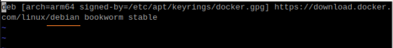

## SETUP with ubuntu-server(controller) and two raspberry pi's (workers)
(NOTE: second worker will be attempted with Ansible instead of manual steps below)

### First Step: ping the servers with Ansible

#### UBUNTU-SERVER (CONTROLLER)
username: angelcruz <br>
ip-address: 192.168.1.100 <br>

username: pi <br>
ip-address: 192.168.1.248 <br>

username: pi <br>
ip-address: 192.168.1.97 <br>


From your desktop, you can auto login and ssh as the user by copying your ssh id to the remote servers, for example:<br>

    ssh-copy-id pi@192.168.1.248 (log in normally)
    ssh pi@192.168.1.248 (you will get logged in automatically)
    


### Manually installing kubernetes on the Master Node

This guide focuses on setting up a single-node control plane using kubeadm.

Prerequisites (on the control plane node):

Code

    sudo apt update && sudo apt upgrade -y


### Disable Swap  (Master and Workers): Kubernetes requires swap to be disabled.

Code

    sudo swapoff -a
    sudo sed -i '/ swap / s/^\(.*\)$/#\1/g' /etc/fstab


### Configure Kernel Modules and Parameters: Enable necessary kernel modules and sysctl parameters for Kubernetes networking.

Code

    sudo modprobe overlay
    sudo modprobe br_netfilter
    
    cat <<EOF | sudo tee /etc/modules-load.d/k8s.conf
    overlay
    br_netfilter
    EOF
    
    cat <<EOF | sudo tee /etc/sysctl.d/k8s.conf
    net.bridge.bridge-nf-call-iptables  = 1
    net.bridge.bridge-nf-call-ip6tables = 1
    net.ipv4.ip_forward                 = 1
    EOF

Invoke: <br>

Code

    sudo sysctl --system


###  Install Container Runtime (e.g., containerd): Kubernetes needs a container runtime.

Code

        sudo apt update
        sudo apt install -y apt-transport-https ca-certificates curl gnupg lsb-release
        sudo mkdir -p /etc/apt/keyrings
        curl -fsSL https://download.docker.com/linux/ubuntu/gpg | sudo gpg --dearmor -o /etc/apt/keyrings/docker.gpg
        echo \
          "deb [arch=$(dpkg --print-architecture) signed-by=/etc/apt/keyrings/docker.gpg] https://download.docker.com/linux/ubuntu \
          $(lsb_release -cs) stable" | sudo tee /etc/apt/sources.list.d/docker.list > /dev/null
        sudo apt update
        sudo apt install -y containerd.io
        sudo containerd config default | sudo tee /etc/containerd/config.toml
        sudo sed -i 's/SystemdCgroup = false/SystemdCgroup = true/g' /etc/containerd/config.toml
        sudo systemctl restart containerd
        sudo systemctl enable containerd

__NOTE:__ <br>

The docker.list above may be problematic (it may point to ubuntu or raspian depending on what you echo from above during Google search).  What works is this:



### Add Kubernetes APT Repository.

Code

	curl -fsSL https://pkgs.k8s.io/core:/stable:/v1.29/deb/Release.key | sudo gpg --dearmor -o /etc/apt/keyrings/kubernetes-apt-keyring.gpg
	echo 'deb [signed-by=/etc/apt/keyrings/kubernetes-apt-keyring.gpg] https://pkgs.k8s.io/core:/stable:/v1.29/deb/ /' | sudo tee /etc/apt/sources.list.d/kubernetes.list
	sudo apt update


### Install kubeadm, kubelet, and kubectl:

Code

    sudo apt install -y kubelet kubeadm kubectl
    sudo apt-mark hold kubelet kubeadm kubectl


### Initialize Kubernetes Control Plane:
Initialize the Cluster: Replace <your_pod_cidr> with a suitable CIDR range (e.g., 10.244.0.0/16 for Calico).

Code

    sudo kubeadm init --pod-network-cidr=10.244.0.0/16

RESULT:

```
Your Kubernetes control-plane has initialized successfully!

To start using your cluster, you need to run the following as a regular user:

  mkdir -p $HOME/.kube
  sudo cp -i /etc/kubernetes/admin.conf $HOME/.kube/config
  sudo chown $(id -u):$(id -g) $HOME/.kube/config

Alternatively, if you are the root user, you can run:

  export KUBECONFIG=/etc/kubernetes/admin.conf

You should now deploy a pod network to the cluster.
Run "kubectl apply -f [podnetwork].yaml" with one of the options listed at:
  https://kubernetes.io/docs/concepts/cluster-administration/addons/

Then you can join any number of worker nodes by running the following on each as root:

kubeadm join 192.168.1.100:6443 --token uskjn0.6j6cpeywo3jlq5of \
	--discovery-token-ca-cert-hash sha256:f9ef604bef57dc5a5550b58ffd6b102e3932d6aad5ce28d9a450195857b29415 

```

NOTE: To create the join commands again, invoke:<br>
``` kubeadm token create --print-join-command ```
<br> The above is required if adding new worker nodes at a later time

### Configure kubectl.

Code

    mkdir -p $HOME/.kube
    sudo cp -i /etc/kubernetes/admin.conf $HOME/.kube/config
    sudo chown $(id -u):$(id -g) $HOME/.kube/config

### Install a Pod Network Add-on:

Deploy a Network Plugin: Calico is a common choice.
Code

    kubectl apply -f https://docs.projectcalico.org/manifests/calico.yaml


### Verify the Cluster:
Check Node Status.
Code

    kubectl get nodes

RESULT:<br>


### The control plane node should show as Ready. Check Pods.

Code

    kubectl get pods --all-namespaces

All core Kubernetes pods (kube-apiserver, kube-controller-manager, kube-scheduler, etcd, coredns) and the network plugin pods should be running.


## SETUP Raspberry Pi (workers)
server: 192.168.1.248 <br>
user: pi <br>
vnc pass: rasp... <br>


### Disable Swap: Kubernetes requires swap to be disabled.

Code

    sudo swapoff -a
    sudo sed -i '/ swap / s/^\(.*\)$/#\1/g' /etc/fstab

### Enable Kernel Modules and Configure sysctl.

Code

    cat <<EOF | sudo tee /etc/modules-load.d/k8s.conf
    overlay
    br_netfilter
    EOF

    sudo modprobe overlay
    sudo modprobe br_netfilter

    cat <<EOF | sudo tee /etc/sysctl.d/k8s.conf
    net.bridge.bridge-nf-call-iptables = 1
    net.bridge.bridge-nf-call-ip6tables = 1
    net.ipv4.ip_forward = 1
    EOF

    sudo sysctl --system


### Install necessary packages and add Docker's GPG key and repository:

Code

    sudo apt-get update -y
    sudo apt-get install ca-certificates curl gnupg lsb-release -y
    sudo mkdir -p /etc/apt/keyrings
    curl -fsSL https://download.docker.com/linux/debian/gpg | sudo gpg --dearmor -o /etc/apt/keyrings/docker.gpg
    echo "deb [arch=$(dpkg --print-architecture) signed-by=/etc/apt/keyrings/docker.gpg] https://download.docker.com/linux/debian $(lsb_release -cs) stable" | sudo tee /etc/apt/sources.list.d/docker.list > /dev/null

### Install Containerd and configure its cgroup driver:

Code

    sudo apt-get update -y
    sudo apt-get install containerd.io -y
    sudo containerd config default | sudo tee /etc/containerd/config.toml
    sudo sed -i 's/SystemdCgroup = false/SystemdCgroup = true/g' /etc/containerd/config.toml
    sudo systemctl restart containerd

### Add Kubernetes apt repository.

Code

    sudo apt-get update
    sudo apt-get install -y apt-transport-https ca-certificates curl
    curl -fsSL https://pkgs.k8s.io/core:/stable:/v1.29/deb/Release.key | sudo gpg --dearmor -o /etc/apt/keyrings/kubernetes-apt-keyring.gpg
    echo 'deb [signed-by=/etc/apt/keyrings/kubernetes-apt-keyring.gpg] https://pkgs.k8s.io/core:/stable:/v1.29/deb/ /' | sudo tee /etc/apt/sources.list.d/kubernetes.list


Note: Replace v1.29 with your desired Kubernetes version if different. Install the Kubernetes components.

### install kubeadm and kubelet:

Code

    sudo apt-get update
    sudo apt-get install -y kubelet kubeadm kubectl

### Hold the packages to prevent automatic updates:

Code

    sudo apt-mark hold kubelet kubeadm kubectl

### Join the Cluster

Code

    kubeadm join 192.168.1.100:6443 --token uskjn0.6j6cpeywo3jlq5of --discovery-token-ca-cert-hash sha256:f9ef604bef57dc5a5550b58ffd6b102e3932d6aad5ce28d9a450195857b29415

__RESULT__:

kubeadm join The system verification failed CONFIG_AUFS_FS: not set - Required for aufs CONFIG_CGROUP_HUGETLB: not set - Required for hugetlb cgroup. CGROUPS_MEMORY: missing CGROUPS_HUGETLB: missing


[WARNING SystemVerification]: <span style="color:red">missing optional cgroups: hugetlb</span>
    error execution phase preflight: [preflight] Some fatal errors occurred:
<span style="color:red">[ERROR SystemVerification]: missing required cgroups: memory</span>
    [preflight] If you know what you are doing, you can make a check non-fatal with `--ignore-preflight-errors=...

__Attempt to Fix:__

*Enable Memory Cgroups on Raspberry Pi OS*

Edit the boot configuration: Open the boot command line file:
Add these parameters to the end of the line (don’t create a new line):

    sudo nano /boot/cmdline.txt
    cgroup_enable=memory cgroup_memory=1

    sudo reboot


Verify cgroups are enabled: After reboot, check:

    mount | grep cgroup

result:<br>
"cgroup2 on /sys/fs/cgroup type cgroup2 (rw,nosuid,nodev,noexec,relatime,nsdelegate,memory_recursiveprot)"
<br>Looks good.

### Rerun the join command:

    sudo kubeadm join 192.168.1.100:6443 --token uskjn0.6j6cpeywo3jlq5of --discovery-token-ca-cert-hash sha256:f9ef604bef57dc5a5550b58ffd6b102e3932d6aad5ce28d9a450195857b29415

*Result:*
node not coming up

__Attempt to Fix:__

    sudo systemctl status kubelet
    sudo journalctl -u kubelet -xe > tmp_log.txt

*check the contents of the tmp_log.txt file:*<br>

"command failed" err="failed to run Kubelet: running with swap on is not supported, please disable swap!

Note: <br>
Swap is still on?  We already disabled it?

### turn swap off again 

    sudo swapoff -a

### check /etc/fstab file

    sudo nano /etc/fstab

### Look for a line that references swap, something like:
    /swapfile swap swap defaults 0 0

### is dynamic swapping on?
    sudo swapon --show

Result: <br>
No

### CLEANUP kubeadm join first before rerunning:
    sudo kubeadm reset
    sudo systemctl stop kubelet

__Then verify port 10250 is free__:

    sudo lsof -i :10250

__Remove Leftover files:__

    sudo rm -rf /etc/kubernetes
    sudo rm -rf /var/lib/kubelet
    sudo rm -rf /var/lib/etcd
    sudo rm -rf ~/.kube

### In Master Server: Get state of Nodes 

    k get nodes

Result:<br>

    raspberrypi-1              NotReady   <none>          9m54s   v1.29.15 

### Check Node Conditions

    open /run/systemd/resolve/resolv.conf: no such file or directory

<br> OR you can run this command and it will lead to the same result

    kubectl describe node raspberrypi-1

results: <br>
open /run/systemd/resolve/resolv.conf: no such file or directory

__Fix attempt:__

On your Raspberry Pi node, run:

    sudo ln -sf /etc/resolv.conf /run/systemd/resolve/resolv.conf

result: <br>
this fails because /run/systemd/resolve does not exist.  Need to create it manually.

__create it then in raspberry pi:__

    sudo mkdir -p /run/systemd/resolve
    sudo ln -sf /etc/resolv.conf /run/systemd/resolve/resolv.conf
    sudo systemctl restart kubelet

*RESULT*:<br>
__SUCCESS__