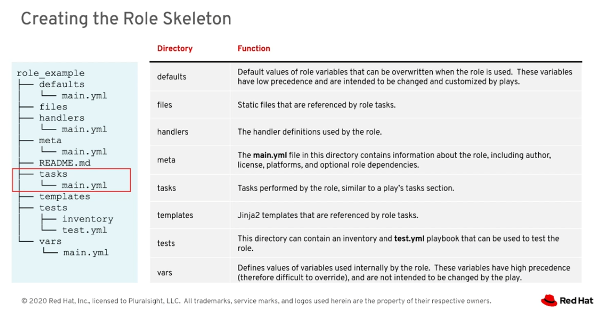
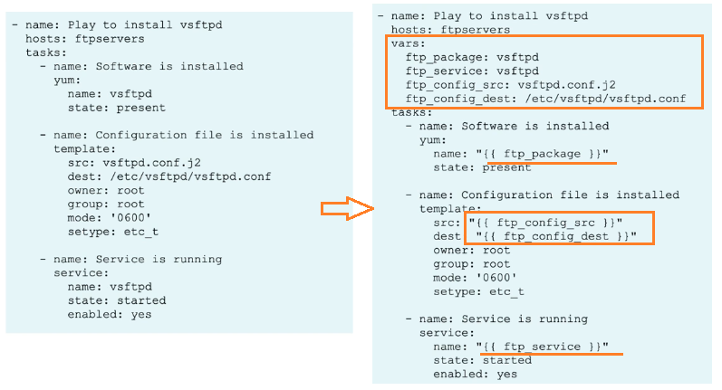

# Ansible Fundamentals

Source: 
E:\videos\ansible\AnsibleDocker\Ansible Fundamentals\

## Roles
- Ansible roles allow you to make automation code more reusable
- Provids packages tasks that can be configure through variables
- The playbook just calls the role and passes it the right values through its variables
- Allows you to create generic code for one project and reuse it on other projects
- Roles group content, allowing easy sharing of code with others
- Roles can be written in a way that define the essential elements of a system type: web server, database server, Git repository, and more
- Roles make larger projects more manageable
- Different Administrators can develop roles in parallel

### Install Promethues using Roles

    Install_Prometheus_to_Cluster/
    ├── prometheus-playbook.yml
    ├── inventory.ini
    ├── defaults/
    │   └── main.yml
    ├── files/
    │   └── prometheus-config.yml
    ├── handlers/
    │   └── main.yml
    ├── meta/
    │   └── main.yml
    ├── tasks/
    │   └── main.yml
    ├── templates/
    │   ├── prometheus-deployment.yaml.j2
    │   ├── prometheus-service.yaml.j2
    │   └── prometheus-servicemonitor.yaml.j2
    ├── vars/
    │   └── main.yml

#### Testing the template

> Attempt 1:

    ansible localhost -m template -a "src=prometheus-deployment.yaml.j2 dest=/tmp/test.yaml"

    kubectl apply --dry-run=client -f /tmp/test.yaml

__RESULT__:

An exception occurred during task execution. To see the full traceback, use -vvv. The error was: ansible.errors.AnsibleUndefinedVariable: 'prometheus_namespace' is undefined. 'prometheus_namespace' is undefined localhost | FAILED! => { "changed": false, "msg": "AnsibleUndefinedVariable: 'prometheus_namespace' is undefined. 'prometheus_namespace' is undefined" }

__EXPLANTAION__:

Ah, that error is totally expected — and easy to fix. The issue is that when you run the ansible command directly like that, it doesn’t load your playbook variables (like prometheus_namespace). So Ansible has no idea what {{ prometheus_namespace }} means.

> Attempt 2

    ansible localhost -m template -a "src=prometheus-deployment.yaml.j2 dest=/tmp/test.yaml" -e "prometheus_namespace=monitoring"

__RESULT__:

An exception occurred during task execution. To see the full traceback, use -vvv. The error was: ansible.errors.AnsibleUndefinedVariable: 'prometheus_image' is undefined. 'prometheus_image' is undefined localhost | FAILED! => { "changed": false, "msg": "AnsibleUndefinedVariable: 'prometheus_image' is undefined. 'prometheus_image' is undefined" }

__EXPLANATION__

this is a classic case of a missing variable in your template context. Your prometheus-deployment.yaml.j2 file likely includes a line like:

    image: "{{ prometheus_image }}"

But since you're not passing prometheus_image in your command, Ansible throws an error.

> Attempt 3

    ansible localhost -m template -a "src=prometheus-deployment.yaml.j2 dest=/tmp/test.yaml" -e "prometheus_namespace=monitoring prometheus_image=prom/prometheus:v2.52.0"

💡 Pro Tip
If your template uses multiple variables, you can pass them all inline like this:

    -e "prometheus_namespace=monitoring prometheus_image=prom/prometheus:v2.52.0 prometheus_replicas=1"

Or, if you prefer cleaner organization, create a vars.yml file:

    prometheus_namespace: monitoring
    prometheus_image: prom/prometheus:v2.52.0
    prometheus_replicas: 1

Then run:

    ansible localhost -m template -a "src=prometheus-deployment.yaml.j2 dest=/tmp/test.yaml" -e "@vars.yml"

