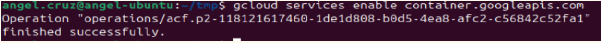

## GCLOUD CLI

### Logout/Login to start fresh


```gcloud auth revoke --all```


### Log in with the desired account

```gcloud auth login```

### Validate your google cloud configuration

```gcloud config list```

RESULT:<br>

><br>[core]
<br>account = anghotpekpek@gmail.com
<br>disable_usage_reporting = True
<br>project = nth-subset-353010
<br>
<br>Your active configuration is: [default]


### set the default project as current project

```gcloud config set project nth-subset-353010```


### Enable the Kubernetes Engine API

```gcloud services enable container.googleapis.com```




### Get list of E2 Images

```gcloud compute machine-types list > list.log```

### Create Kubernetes Cluster

gcloud container clusters create my-gke-cluster \
    --zone us-central1-a \
    --machine-type e2-micro \
    --num-nodes 2 \
    --release-channel regular

(Note: release-channel regular means auto upgrade the nodes)

### Delete Kubernetes Cluster

```gcloud container clusters delete my-gke-cluster --zone=us-central1-a```

## Create Kubernetes Cluster on GCP using Terraform

gke-cluster/
├── main.tf
├── variables.tf
└── outputs.tf

gcloud auth application-default login

